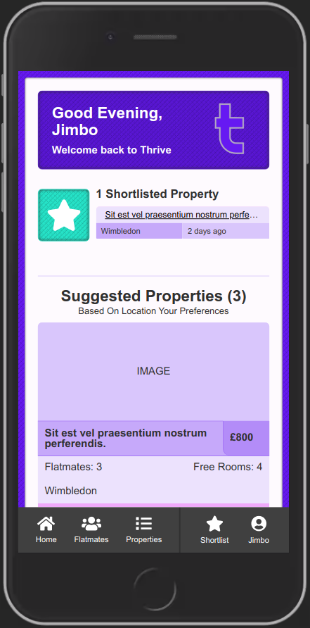
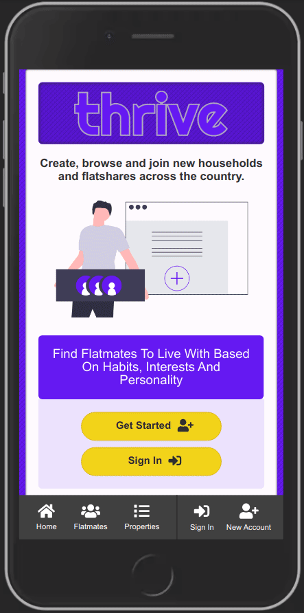
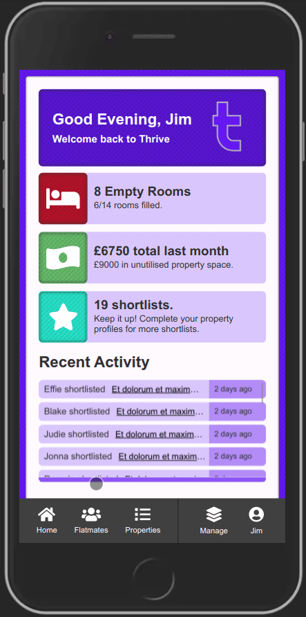
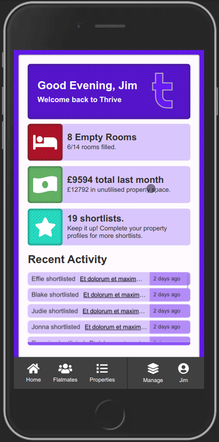
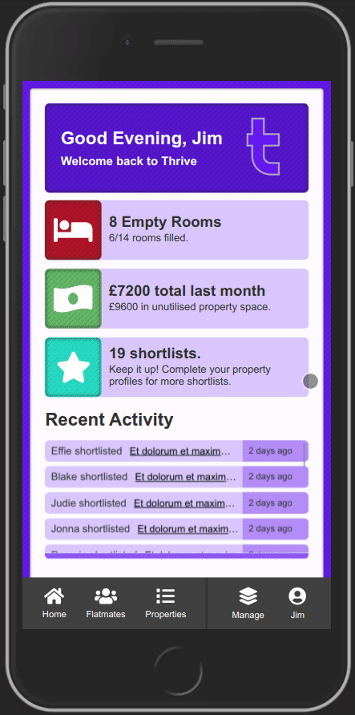
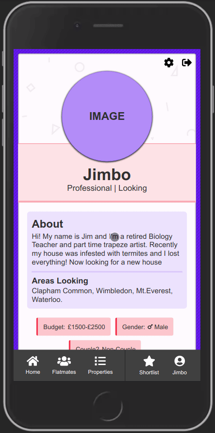
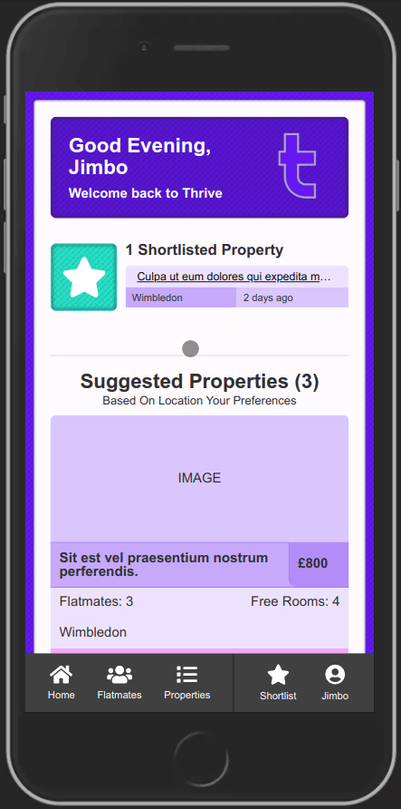

  

  <h1 align="center">🏚️👫 Thrive - Frontend</h1>

<h3 align='center'>
    Find Flatmates, Houseshares, Manage A Household Or Build Your Property Portfolio, All In Once Place.
</h3>

     
    <a href="https://thrive-living.herokuapp.com/"><strong>Visit The Site »</strong></a>
     
     
    <a href="https://github.com/Rhelli/thrive.io-frontend/archive/refs/heads/master.zip">Download this repository</a>
    |
    <a href="https://github.com/Rhelli/thrive.io-frontend/issues">Report A Bug</a>
    |
    <a href="https://github.com/Rhelli/thrive.io-frontend/fork">Fork It</a>
    |
    <a href="https://github.com/Rhelli/thrive.io-backend">Thrive.io Backend</a>
  

## 📑 Table of Contents
  - [The Project Brief](https://github.com/Rhelli/thrive.io-frontend#-the-project-brief)
  - [The Technical Requirements](https://github.com/Rhelli/thrive.io-frontend#-the-technical-requirements)
  - [The App](https://github.com/Rhelli/thrive.io-frontend#the-app)
  - [Application Architecture](https://github.com/Rhelli/thrive.io-frontend#%EF%B8%8F-application-architecture)
  - [Tools & Technology Used](https://github.com/Rhelli/thrive.io-frontend#-tools--technology-used)
  - [Setup & Use](https://github.com/Rhelli/thrive.io-frontend#-setup--use)
  - [Feature Previews](https://github.com/Rhelli/thrive.io-frontend#%EF%B8%8F-feature-previews)
  - [Contributions, Issues and Forking](https://github.com/Rhelli/thrive.io-frontend#%EF%B8%8F-contributions-issues-and-forking)
  - [Creator](https://github.com/Rhelli/thrive.io-frontend#-creator)
  - [Show Your Support!](https://github.com/Rhelli/thrive.io-frontend#-show-your-support))
  - [Licensing](https://github.com/Rhelli/thrive.io-frontend#%EF%B8%8F-licensing)

## 🔰 The Project Brief

This is the Final capstone project of the Microverse Full-Stack Engineering course, to be completed by all students of [Microverse](https://www.microverse.org/).

Capstone projects are unlike the other projects we complete as student of Microverse in that they are timed, performed under specific stipulation, and created to a business-like specification. However as this is the very last Capstone project of the entire course, the requirements are different this time as well.

For the final capstone project of the course, we are required to build upon the skills we have gathered over the entire span of the full-stack curriculum, and create a truly Full-Stack software experience. This entails building both a Ruby on Rails backend, which will act as out database and a React & Redux front-end, which will act as the interface by which the end user will interact with our application. 

## 🚦 The Technical Requirements
The specifications for this capstone project, was to build a 'Find Your House' application, similar in style to AirBnB. The user would be able to:
 - View a list of nearby properties
 - View the properties profiles
 - Can log in and out of the application and create an account for themselves
 - Can save chosen properties via a type of 'favourites' functionality.

Additional technical specifications (in relation to the front-end) are as follows:
 - The project must be a mobile web app
 - The project's front-end React & Redux system must interact with the back-end via various API calls
 - The user must be able to not only retrieve (GET) information from the back-end but also create (POST), update (PUT) and delete (DELETE).
 - The project must utilise Redux as a means of state management, ideally acting as an intermediatory between the back-end and the front-end.

## The App
This is the front end solution for the project. To see the backend, please [follow this link](https://github.com/Rhelli/thrive.io-backend).

The application was initially designed to adhere to the specifications of the project however, the final application is a substantially more feature rich experience.

### How Does It Work?
The application serves three specific purposes:
 1. It allows users to look and find flatmates or flatshares. ([What is a flatshare?](https://dictionary.cambridge.org/dictionary/english/flatshare)).
 2. It allows users to look for flatmates and advertise their homes to share with other tenants.
 3. It allows Landlord or Companies to advertise multiple properties to all users.

The main premise is not an unheard of one, but an idea that is beginning to become more popular in large, expensive cities around the world. Due to the extremely high rental costs in cities, the only sustainable way for individuals to rent properties, is to band together and split the rent. This application facilitates that process.

### User Types
As the application is concerned with either letting users find flatshares or letting users promote their own properties, I split the user base up into two main categories of user:
 - 'Looking' users, i.e. users who are using the application to find a property/flatshare
 - 'Advertising' users, i.e. users who either are looking for a person to join their household, or a user who is simply promoting properties.

Users who are 'looking' for flatshares are a simple, one dimensional model - they are presented with properties who are looking for someone to join them. 'Advertising' users, on the other hand, are split up in to two further categories - Landlords, and Flatmates:
 - Flatmates can only have and manage one household as they are a tenant, just like the other house members and do not own multiple properties
 - Landlords can have and manage multiple properties.

### Information
Moving into a shared household is a big move. It would follow, then, that most people would not make such a move (especially over the internet), unless provided with a wealth of information about the property they would be moving into and the flatmates they would share it with. Therefore, I tried to maximise the varying (and salient) information about the property and its inhabitants in order to make choosing a new flatshare for the user as easy as possible. Ultimately, with this form of service, the less information there is about the property, the less useful this application is.

## ⚙️ Application Architecture
As this repository is the for the front-end system, I will only cover the React & Redux portion of the application here. To see the back-end oriented application architecture, [head here.]()

### File Structure
  The file structure of this app uses a [View-State Split](https://www.pluralsight.com/guides/how-to-organize-your-react-+-redux-codebase) design, in order to entirely separate each components state management, from it's view.

  The choice for using such a file structure is that it is exceedingly easy to visualise and organise the state of the project - there is no room for confusion. Additionally all redux code is located in one place, with the (predominantly) React based code location in another.

### API Calls
  API calls are performed using Javascript's [Fetch](https://developer.mozilla.org/en-US/docs/Web/API/Fetch_API) API and [Redux-Thunk](https://github.com/reduxjs/redux-thunk) middleware has been implemented to handle the successful (or, unsuccessful) API return and store it into the Redux state immediately.

### Application State
  Whilst the user's data is perpetuated in the backend and updated periodically at suitable intervals, state is managed internally by use of both Redux and React Hooks. 

## 🧰 Tools & Technology Used
**Languages & Frameworks**
 - HTML5
 - SASS
 - ES6 Javascript
 - React
 - Redux
 - NPM

**NPM Packages Of Note**
 - [PropTypes](https://reactjs.org/docs/typechecking-with-proptypes.html)
 - [React-Loader-Spinner](https://www.npmjs.com/package/react-loader-spinner)
 - [FontAwesome](https://fontawesome.com/)
 - [React-Router-DOM](https://reactrouter.com/web/guides/quick-start)
 - [Redux-Thunk](https://github.com/reduxjs/redux-thunk)
 - [Redux-Logger](https://github.com/LogRocket/redux-logger)
 - [SwiperJS](https://swiperjs.com/)

**Linters & Quality Control**
 - [ESLint](https://eslint.org/)
 - [StyleLint](https://stylelint.io/)

**Deployment**
 - Heroku

### 🚀 Setup & Use
[Head here]() if you'd like to see the live site. If you'd like a closer look, continue reading....

#### Setup
If you would like to tinker with this project a little more, then we will have to ensure your machine is correctly setup.

  1. Ensure that you have [Node.js](https://nodejs.org/) installed on your machine. The project will not run without it.

  2. Time to download this repository. Either download the repository [here]() or clone this repository onto your computer. [Not sure what 'Cloning' is? Follow this guide.](https://docs.github.com/en/github/creating-cloning-and-archiving-repositories/cloning-a-repository)

  3. Once you have this project downloaded or cloned to your machine, `cd` to the root of the project in your terminal. [Not sure what 'CD' means? Follow this guide.](https://www.macworld.com/article/2042378/master-the-command-line-navigating-files-and-folders.html)

  4. Time for the last step of setup! Type `npm install` into your terminal. This will install all the required packages and software that your machine does not already have.

#### Usage
Whilst this project has been predominantly built for use as a web page, there are still a few commands you can use to interact with the project:

 - `npm start` - This will start up the project in your default browser. From here, any changes made to the project will update in real time.
 - `npm test` - This will run all implemented tests using Jest.
 - `npm build` - This will build a static, production build of the project.

******

## 🎟️ Feature Previews
### Sign In

> A quick example of the sign in process and the 'Advertising' user types homepage.

### Flatmates

> The flatmates index and their profiles.

### Properties

> A quick look at the property index and their profiles.

### Property Management - Profiles and Updating

> Property Management. Functionality seen here is only available to 'Advertising' type users.

### Changing User Type

> Users can swap between being an advertising user or a 'looking' user, however they cannot retain a portfolio of properties if they are looking.

### The Looking Users' Homepage

> The design of the site is maintained in the mobile view, however everything is shrunk down and resized in order to maintain a pleasant web experience.

### Shortlisted Properties

> Adding and removing shortlisted properties can be done on both the property's page and the 'Shortlist' page.

*******

## 🛎️ Contributions, Issues and Forking

Contributions, issues and feature requests are not just welcome, but encouraged!

First and foremost, if you have any problems running or setting this project up, please submit it as a bug on the [issues page.](https://github.com/Rhelli/thrive.io-frontend/issues) right away!

If you want to make your own changes, modifications or improvements, go ahead and Fork it!
1. [Fork it](https://github.com/Rhelli/thrive.io-frontend/fork)
2. Create your working branch (git checkout -b [choose-a-name])
3. Commit your changes (git commit -am 'what this commit will fix/add/improve')
4. Push to the branch (git push origin [chosen-name])
5. Create a new Pull Request

## 💂🏽💻 Creator

Rory Hellier - [Github](https://github.com/Rhelli)

## 🖐🏼 Show Your Support!
If enjoyed this project, thought the implementation was good or even liked the colour scheme, please do give the project a 🌟. It makes a huge difference!

## ⚖️ Licensing
This project is [Privately](https://github.com/Rhelli/thrive.io-frontend/blob/master/README.md) licensed, Copyrighted and is not intended for free distribution or monetisation without prior permission being obtained from the creator.
